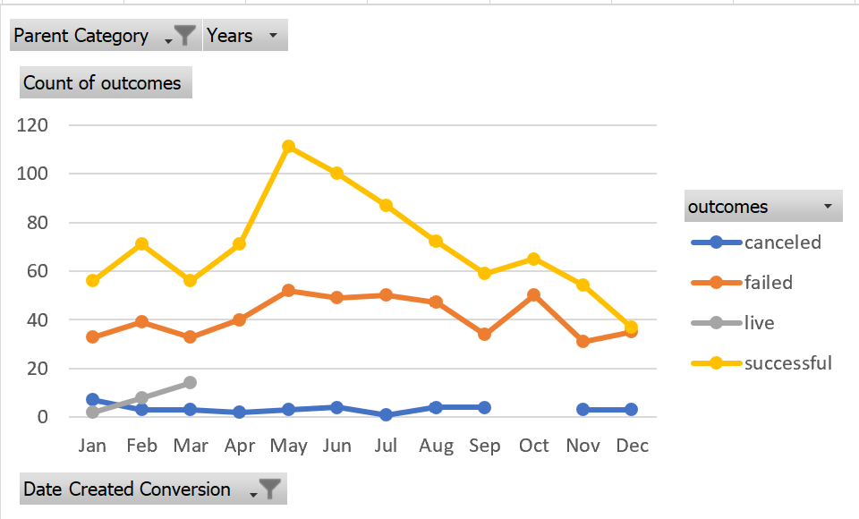
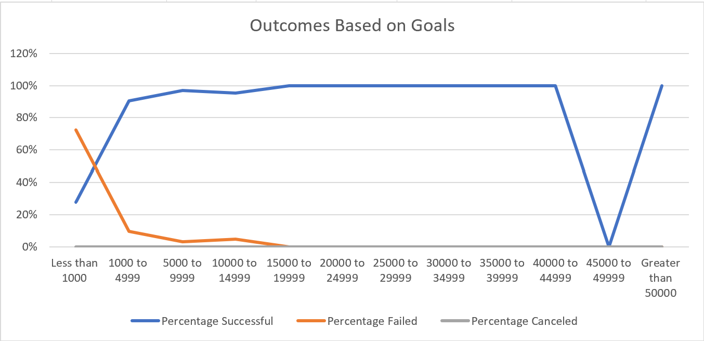

# An Analysis of Kickstarter Campaigns
## Overview of Project
### Purpose
The purpose of the analysis is to find a relation between campaign launch dates and if they met their funding goals. A Kickstarter dataset was used to get information on how much a campaign was able to raise. The dataset provided different variables such as country, campaign launch date, and goal. Filters were applied to focus on the data that would be more helpful to understand the outcomes based on launch date and outcomes based on goals. 

## Analysis and Challenges

### Analysis of Outcomes Based on Launch Date
In order to analyze the outcomes based on launch date, a pivot was created to summarize and group the campaign status by month. By looking at the pivot table, you can clearly see that May had the most successful campaigns with 111. The month with the least successful campaigns was October. There is an increase of successful campaign during the summer months (May, June, July) and theres a decrease when fall starts. Failed and successful campaigns were tied during December. December also had the lowest number of campaign started. A factor that would have an effect in December's sucess/failed campaigns are the end of year holidays. People have other priorities during that month such as gifts and parties. Based on this data, starting a campaign during the summer months is recommended. 

### Analysis of Outcomes Based on Goals

In order to analyze the outcomes based on goals, COUNTIFS formula was used to find how many campaigns for plays were succesful, failes, and canceled. After getting the totals for each category, we were able to get the percentages for each category. Based on the analysis and supported by the graph below, the majority of campaigns that had a goal of fundraising more than $15,000 were successful. The campaigns with a goal of less than $1000 mostly failed with only 28% being successful. 

### Challenges and Difficulties Encountered

## Results

- What are two conclusions you can draw about the Outcomes based on Launch Date?
1. Based on the analysis, starting a campaign during the summer months is recommended. 
2. Winter had the least successful campaigns. 

- What can you conclude about the Outcomes based on Goals?
Campaigns with a goal greater than $15,000 were most likely to be funded. Campaigns with a goal of less than $1,000 had the highest percentage for failed campagins. 

- What are some limitations of this dataset?
I would like to understand more why the campaigns that had a goal of less than $1,000 were not successful. One way to analyze that would be to see the month they got created. There are some trends that show that the winter months are not the best for fundraising so there might be a connection. Also, we could analyze the categories to get some insights on what categories are more popular for fundraising. 

- What are some other possible tables and/or graphs that we could create?
As mentioned above, I would like to analyze the dates on which the campaigns for less tna $1,000 were created and the categories. 

